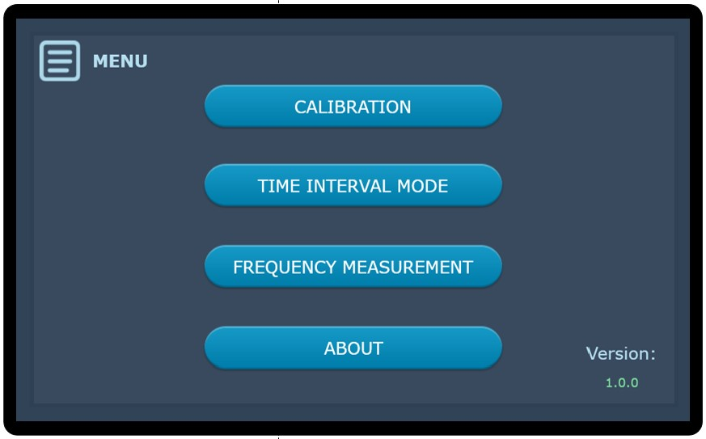
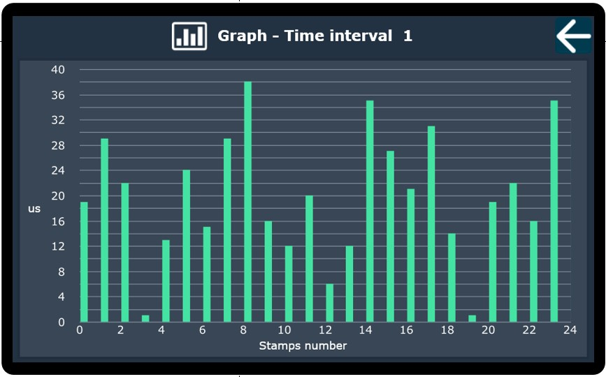

# STM32F7-TouchGFX-GUI-Time_counter

Graphic interface design for the [MTC 108 timer](https://ztc.wel.wat.edu.pl/mtc108.html). The design also includes a backend timer simulator linked to the GUI.

## Hardware

- **[STM32F769I-DISC0](https://www.st.com/en/evaluation-tools/32f769idiscovery.html)**

## Functions

- **Time Interval-Independent**
- **Frequency measurement**

There are 4 types of measurements in both modes: single, continuous, stamps and repeat.

## UI presentation (part)

